# Rasa X User Guide

This guide helps non-technical users understand, train, and manage chatbots using **Rasa X** through a simplified and practical interface.

---

## Table of Contents

### A. Rasa X

1. [What is Rasa X?](#1-what-is-rasa-x)
2. [Connecting Rasa X to GitLab](#2-connecting-rasa-x-to-gitlab)
3. [Main Components of Rasa X](#3-main-components-of-rasa-x)
4. [How It Works](#4-how-it-works)

### B. Training Data

1. [NLU Data](#1-nlu-data)
2. [Responses](#2-responses)
3. [Rules](#3-rules)
4. [Configuration (Advanced)](#4-configuration-advanced)
5. [Domain File](#5-domain-file)

### C. Active and Trained Models

- [Managing Models](#managing-models)

### D. Test, Improve, and Trace the Bot

1. [Talk to Your Bot](#talk-to-your-bot)
2. [Conversations](#conversations)
3. [NLU Inbox](#nlu-inbox)
4. [Intent Insights](#intent-insights)
5. [Push Edits to Training](#push-edits-to-training)

---

## A. Rasa X

### 1. What is Rasa X?

Rasa X is a **web interface** to:

- Train and improve your chatbot
- Manage training data
- Review conversations
- Share the bot with others

It makes bot management accessible to non-developers.

---

### 2. Connecting Rasa X to GitLab

- Open the **Git** tab from the sidebar in Rasa X And click On connect To Git repository.

   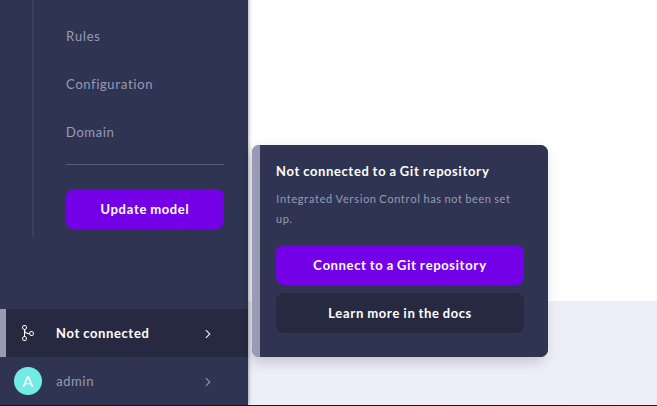

- In the Popup Window:

  - Paste the **SSH GitLab repository URL**
  - Enter the branch name (e.g., `main`, `develop`)
  - Copy the SSH key

   

- In GitLab:

  - Go to **Settings → Repository → Deploy Keys**
  - Click **Add Key**
  - Paste the SSH key copied from Rasa X
  - Give the key a name
  - Enable **Write Access**
  - Click **Add Key**

   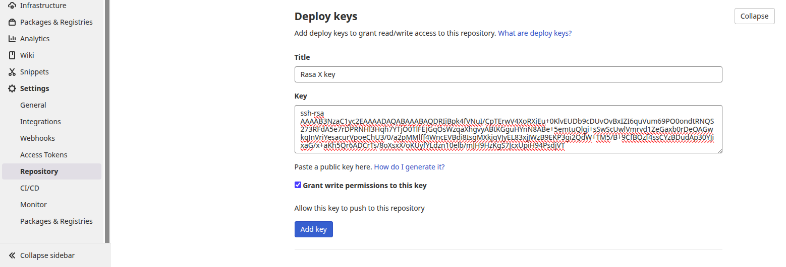

- You can change the branch later if needed.

- Click **Verify Connection** to confirm Git integration.

- For more help, follow this [Git connection guide](https://medium.com/analytics-vidhya/rasa-advanced-deployment-part-3-git-connection-373792fbd54a).

---

### 3. Main Components of Rasa X

| Component     | Description                                      |
| ------------- | ------------------------------------------------ |
| **Intents**   | What the user wants (e.g., `greet`)              |
| **Entities**  | Variable in the user massage like names, dates   |
| **Responses** | Bot’s replies (text, image, video, etc.)         |
| **Stories**   | Step-by-step examples of dialogs                 |
| **Rules**     | Simple "if this then that" logic                 |
| **Domain**    | Master file that lists intents, responses, slots |
| **Models**    | Trained versions of your bot                     |

---

### 4. How It Works

The assistant follows this basic flow:

1. A **user sends a message** (e.g., "Hi")
2. **Rasa NLU detects the intent** and any entities
3. **Rasa Core chooses the action** using rules/stories
4. A **response is generated** and shown to the user
5. The conversation loop continues

---

## B. Training Data

### 1. NLU Data

#### What is NLU Data?

NLU (Natural Language Understanding) data teaches the bot how to interpret what users say.

- It includes example messages linked to user intents.
- It teaches the bot how to recognize different ways people say the same thing.

#### How to Add Training Data

Follow these steps to add new examples that teach your bot how users speak:

---

**1. Open the NLU Tab**

Go to the left sidebar and click on the **NLU** section.

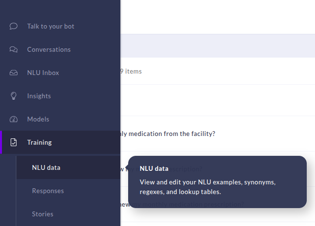

---

**2. (Optional) Use the Search or Filter**

Use the search bar at the top to find a specific intent you want to add examples to.


---

**3. Click the ➕ Button Add a Training Example**

Click the **➕ icon** next to the search bar to add a new example. Then type what a user might say (e.g., "I need help") and choose or create the right intent (e.g., help_request).

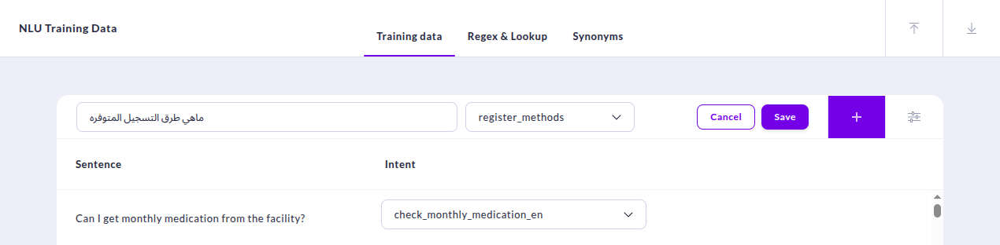

---

### 2. Responses

#### How to Add a Response for an Intent

Create the bot's replies by adding responses that match each intent.

---

**1. Go to the Responses Tab**

From the sidebar, open the **Responses** section to see existing bot replies.


---

**2. Name Your Response**

Use a clear name starting with `utter_` followed by the intent name.  
Example: `utter_greet` or `utter_help_request`


---

**3. Click "Add Response"**

Click the **Add Response** button to start creating a new one And Click Save When you finish.

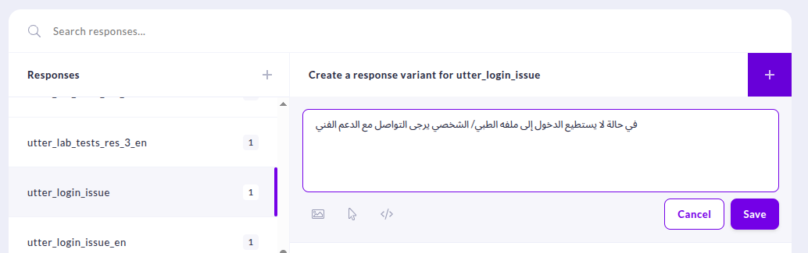

**4. Add One or More Replies**

Type in what the bot should say.
You can add multiple replies for variety — Rasa will pick one at random.


#### How to Add Arabic and English Text Responses

You can add responses in both English and Arabic by creating separate entries for each language:

**A. Add an English Response**

- Name it like `utter_greet_en`.
- Write the message in English.
- Use normal parentheses `(English word)` with **spaces before and after** the word.

**B. Add an Arabic Response**

- Name it like `utter_greet_ar`.
- Write the message in Arabic.
- Use mirrored Arabic parentheses `)Arabic Word(` with **spaces before and after** the word.

**C. Use Clear Naming for Each Language**

- Always keep names unique per language.
- Follow the pattern: `utter_<intent_name>_<lang_code>`  
  (e.g., `utter_help_en`, `utter_help_ar`)

---

#### Add Image or Video

**A. Add an Image**

- Paste a valid image URL into the image field.
- Put a space in the **Text** field.
- The image will be displayed when the bot responds.


**B. Add a Video**

- Paste a video link in the **Image field**.
- Add the prefix `video:` before the link.
  - Example: `video:https://example.com/video.mp4`
- Put a space in the **Text** field


---

#### Add Menu (Buttons)

You can add clickable buttons to a bot response that send specific intents when clicked. Here’s how to do it properly:

---

**A. Create a Response with a Clear Name**

- Use a meaningful name like `utter_main_menu_en` or `utter_MOH_menu_ar`.
- Stick to the naming format: `utter_<purpose>_menu_<lang>` to keep things organized.
- Add a short message or question above the buttons to guide the user.

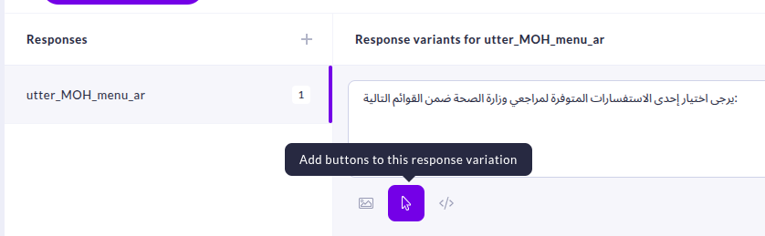

**B. Add Button Title**

- The **Button Title** is what users will see.
- It should be clear, short, and match what the user is trying to do.

---

**D. Add Button Title and Payload**

Each button needs:
- **Title** — this is what the user will see on the button.
- **Payload** — this tells Rasa which intent to trigger when the button is clicked.

Guidelines:
- The **Title** should be clear, short, and user-friendly.  
  Example: `Book a Service`
- The **Payload** must start with `/` and match the intent name.  
  Example: `/book_service`  
  This sends the intent directly without user input.

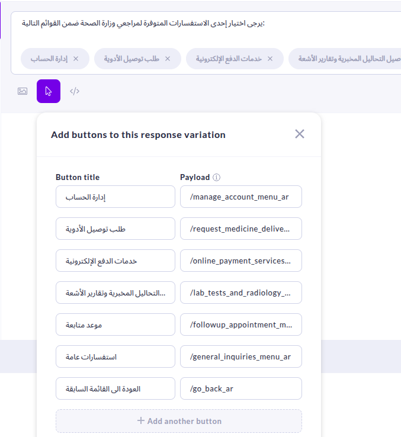

---

### 3. Rules

#### What Are Rules?

Rules map a specific intent to a fixed response or action (like FAQs).

#### How to Add a Rule

Use rules to link a specific user intent to a fixed response or action. Here’s how to add one step-by-step:

**A. Open the Rules Tab**

Click the **Rules** section in the sidebar to view all existing rules.

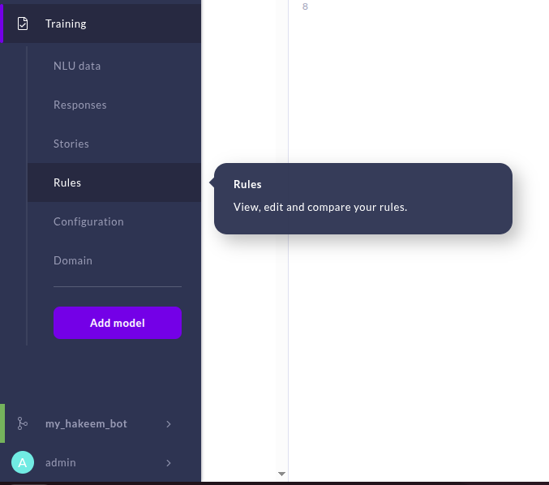


**B. Click "Add Rule"**

Click the **Add Rule** button to start creating a new rule.

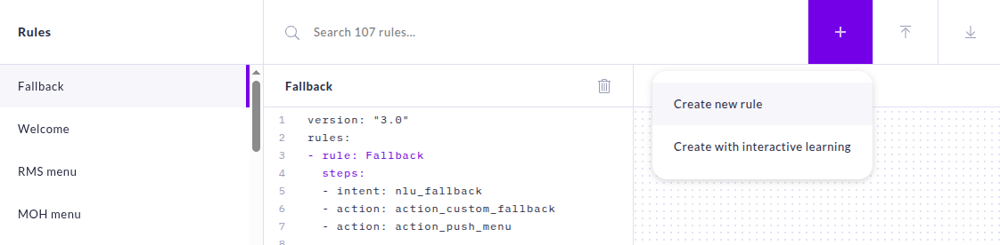

**C. Name the Rule**

Give the rule a meaningful name so you can easily identify it later.


**D. Choose the Trigger Intent**

Select the intent that will activate this rule when a user message matches it.


**E. Add a Response or Action**

Choose a bot response or a custom action that should happen when the rule is triggered.

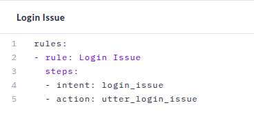

**F. (Optional) Add Multiple Responses in Sequence**

You can add several responses in order, and Rasa will show them one after another.

- For better organization, name each response clearly using this format:  
  `utter_<intent>_res1_en`, `utter_<intent>_res2_ar`, etc.
- Or simply add the responses in the sequence you want them to appear.

 Example:
```
utter_greet_res1_en
utter_greet_res2_en
```

<div style="display: flex; gap: 10px;">
  
  
  
</div>

#### Make sure the format of the steps is the same as shown in the images.
---

### 4. Configuration (Advanced)

Found in `config.yml`, this defines:

- Language pipeline
- Tokenization
- Embeddings
- Fallback logic

Only modify if you understand Rasa internals.

---

### 5. Domain File

Located in `domain.yml`, this file defines:

- Intents
- Entities
- Responses
- Slots
- Actions (e.g., `action_custom_fallback`)
- Forms

---

### C. Active and Trained Models

Train and manage different versions of your assistant by following these steps:

---

**A. Go to the Train Tab (Add Model or Update Model)**

- Click on the **Train Model** tab in the sidebar to start training a new model.

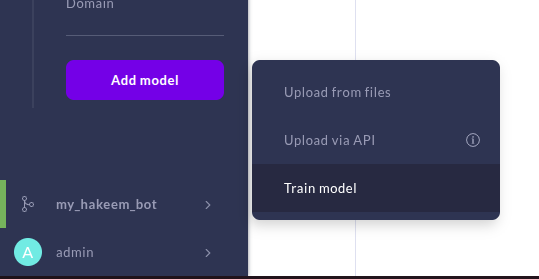


**B. Open the Models Tab**

- After training is done, go to the **Models** tab to view available models.


---

**C. Activate the Newest Model**

Click the **Activate** button next to the latest model to make it live.


---

# E. Test, Improve, and Trace the Bot

## 1. Talk to Your Bot

Interact directly with your assistant in the browser to test and trace responses.

- Open the **Talk to your bot** tab from the sidebar in Rasa X  
  

- Start chatting with your bot and observe the detected intents and responses.  
  

---

## 2. Conversations

### Review Conversations

Monitor conversations from real users to evaluate performance and issues.

- Open the **Conversations** tab from the sidebar  
  

- Review all conversations, see user info, and choose to mark reviewed, save for later, or delete.  
  

### Share Bot

Generate a shareable link so others can try your bot.  


### Correct Bot Responses

Update incorrect responses or detected intents:

1. Click the icon beside the message to correct the intent  
   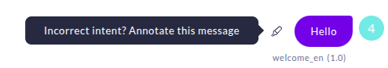

2. Select the correct intent and click **Save to training data**  
   

3. You can also flag incorrect messages for review  
   

---

## 3. NLU Inbox

Review confusing or unclassified messages and assign correct intents.

- Open the **Conversations** tab and switch to **NLU Inbox**  
  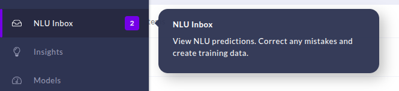

- Filter and manage messages, go to the full conversation, approve or delete them  
  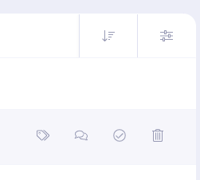

- Choose the correct intent and save  
  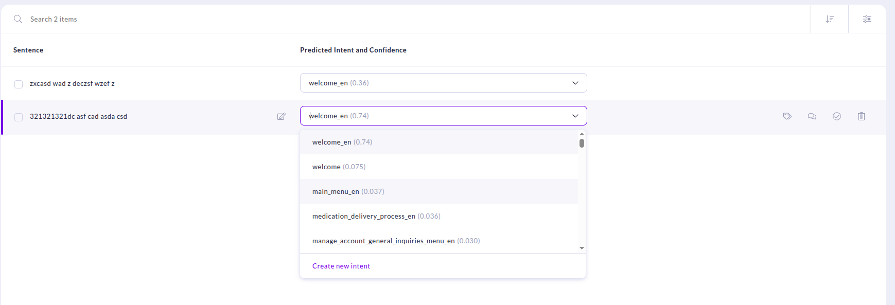

---

## 4. Intent Insights

Track performance and identify confusion in intents.

- Open the **Insights** tab  
  

- Choose to run the evaluation now or schedule it  
  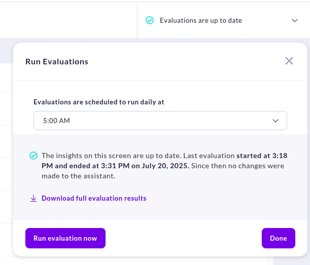

- Review insights such as intent usage, confidence scores, and improvement suggestions  
  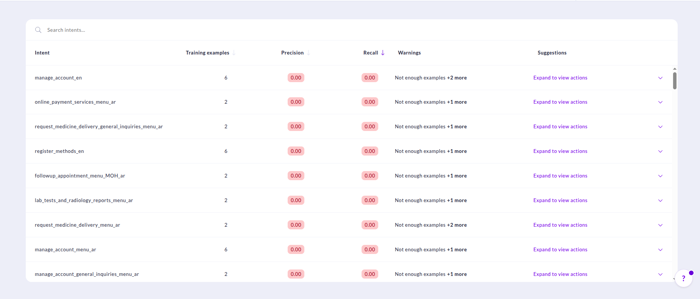

---

## 5. Push Edits to Training

Push all reviewed and corrected changes to your Git repository.

1. Open the **Git** tab from the sidebar and click **Add Changes to Git Server**  
   

2. Choose a new branch name and optionally add a commit message  
   
